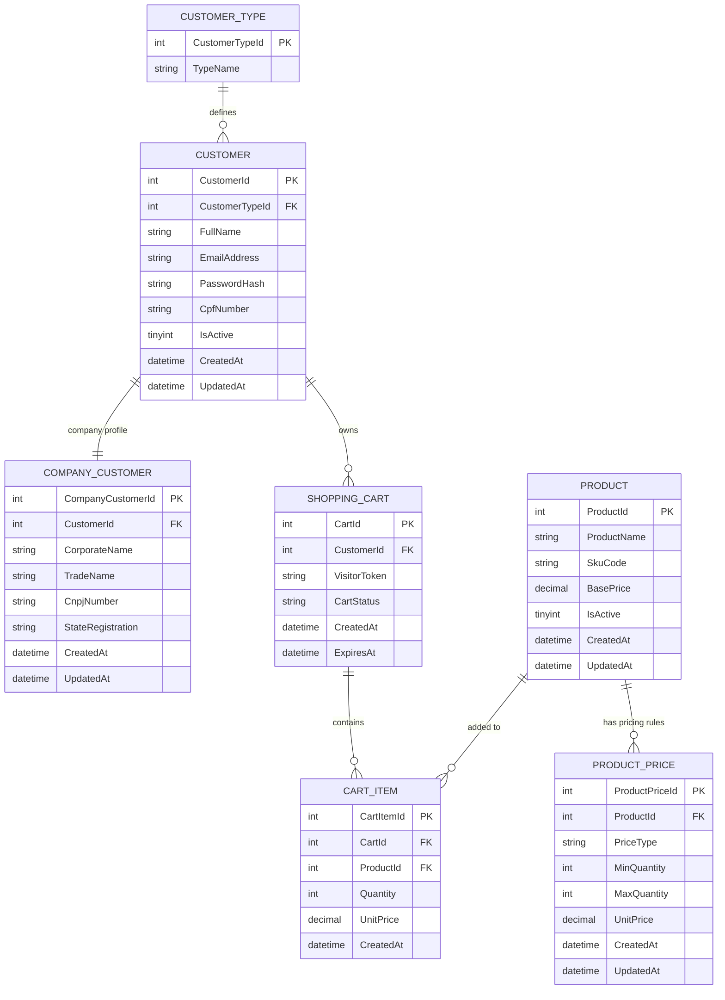

# 📦 **OnlineStore – E-commerce Base Project**
### Documentação Oficial • README.md
Este documento apresenta a **análise de requisitos**, **modelagem de banco de dados**, **regras de negócio** e **estrutura inicial** do projeto **OnlineStore**, um e-commerce modular e extensível desenvolvido com foco em clareza, escalabilidade e organização.

---

# 🧭 **1. Visão Geral do Projeto**

O objetivo deste projeto é criar uma base sólida para um sistema de e-commerce moderno, capaz de atender três tipos de clientes:

- **Visitante (Guest)** – navega sem cadastro  
- **Pessoa Física (Individual)** – possui cadastro, login e CPF  
- **Pessoa Jurídica (Company)** – empresa com CNPJ e informações corporativas  

O sistema suporta:

- Carrinho com persistência para visitantes e clientes cadastrados  
- Preços diferenciados por quantidade (varejo e atacado)  
- Produtos com regras flexíveis de precificação  
- Estrutura extensível para pedidos, pagamento, logística, promoções etc.  

---

# 📝 **2. Análise de Requisitos**

Esta é a documentação funcional que orienta a modelagem e as decisões do back-end.

---

## **2.1. Tipos de Usuários**

### 🔹 **Visitante (Guest)**
- Não precisa de cadastro  
- Pode navegar e adicionar produtos ao carrinho  
- Carrinho é salvo usando **VisitorToken**  
- Carrinho expira após **1 dia** sem retorno ao site  

### 🔹 **Cliente Pessoa Física (Individual)**
- Possui cadastro com login e senha  
- Tem CPF no cadastro  
- Carrinho fica salvo sem expiração imediata  
- Pode visualizar histórico e dados pessoais  

### 🔹 **Cliente Pessoa Jurídica (Company)**
- Cadastro inclui CNPJ, razão social e nome fantasia  
- Pode ter regras específicas como:  
  - preços diferenciados  
  - limites de crédito (futuro)  
  - relatório corporativo  

---

## **2.2. Regras de Produto**

Cada produto pode ter **duas faixas de preço**:

| Tipo de Preço | Quantidade      | Aplicação |
|---------------|-----------------|-----------|
| Retail (varejo) | Ex.: 1 a 9 unidades | Preço padrão |
| Wholesale (atacado) | A partir de 10 unidades | Preço reduzido |

O preço aplicado é recalculado **automaticamente** ao alterar a quantidade no carrinho.

---

## **2.3. Regras do Carrinho**

- O carrinho para visitantes é identificado via **VisitorToken**  
- O carrinho para clientes é via **CustomerId**  
- Cada item do carrinho grava o **UnitPrice no momento da compra**, garantindo histórico confiável  
- Sempre que a quantidade muda, o sistema busca a faixa de preço correta na tabela **ProductPrice**

---

# 🧩 **3. Modelo de Banco de Dados (MySQL)**  
Modelagem com nomes em **inglês americano**, padronização clean code, 2 palavras, e relações normalizadas.

---

## **3.1. Diagrama ER – Mermaid.js**



---

# 🛠️ **4. Scripts das Tabelas (CREATE TABLE)**

O banco foi criado em MySQL com engine **InnoDB**, suporte a chaves estrangeiras e charset **utf8mb4**.

**Tabelas do projeto:**

- CustomerType  
- Customer  
- CompanyCustomer  
- Product  
- ProductPrice  
- ShoppingCart  
- CartItem  

> 🔗 *Os scripts completos estão incluídos em `/database/schema.sql`.*

---

# 🧪 **5. Massa de Teste (INSERTs)**

Foi criada uma massa completa com:

- 5 tipos de clientes  
- 8 clientes  
- 5 empresas PJ  
- 5 produtos  
- 10 faixas de preço  
- 5 carrinhos (visitantes + logados)  
- 6 itens de carrinho  

> 🔗 *Conteúdo completo em `/database/sample-data.sql`.*

---

# ⚙️ **6. Procedures (CRUD Completo)**

Cada tabela possui procedures para:

- Insert  
- Update  
- GetById  
- List  
- Delete  

Exemplo de nome:

```
Proc_Product_Insert
Proc_Product_Update
Proc_Product_ById
Proc_Product_List
Proc_Product_Delete
```

> 🔗 *Arquivo completo: `/database/procedures.sql`.*

---

# 🔍 **7. Relações Entre as Entidades**

### **CustomerType → Customer**
Cada cliente tem um tipo:
- Individual  
- Company  
- Guest  
- Vip  
- Blocked  

### **Customer → CompanyCustomer**
Apenas clientes do tipo "Company" possuem dados corporativos.

### **Customer / Visitor → ShoppingCart**
Um carrinho pode estar vinculado a:
- Cliente logado (**CustomerId**)  
- Visitante (**VisitorToken**)  

### **ShoppingCart → CartItem**
Cada carrinho pode ter vários itens.

### **Product → ProductPrice**
Cada produto tem regras de preços por faixa de quantidade.

### **Product → CartItem**
Os itens do carrinho referenciam produtos.

---

# 🧱 **8. Expansão Futura**

Estrutura preparada para incluir:

- Orders (pedidos)  
- Payments (pagamentos)  
- Shipping (fretes e rastreios)  
- Inventory (controle de estoque)  
- Promoções e cupons  
- API REST com autenticação JWT  
- Painel administrativo (backoffice)  

---

# 🚀 **9. Objetivo do Projeto**

Criar a **base sólida de um e-commerce** que pode crescer sem bagunça, com:

- Modelagem clara  
- Regras de negócio definidas  
- Código limpo e padronizado  
- Escalabilidade para empresas pequenas, médias ou grandes  

---

# 🧑‍💻 **10. Tecnologias Utilizadas**

- **MySQL 8+**  
- **Mermaid.js** (documentação visual)  
- Arquitetura limpa e modular  
- Padrões de nomes em inglês americano  

---

# 📚 **11. Estrutura Recomendada do Repositório**

```
/database
   schema.sql
   sample-data.sql
   procedures.sql

/docs
   requirements.md
   er-diagram.mmd

/src
   (futuro backend ou frontend)
README.md
```

---

# 🟢 **README Finalizado – pronto para GitHub**

Obrigado por utilizar o projeto OnlineStore!
